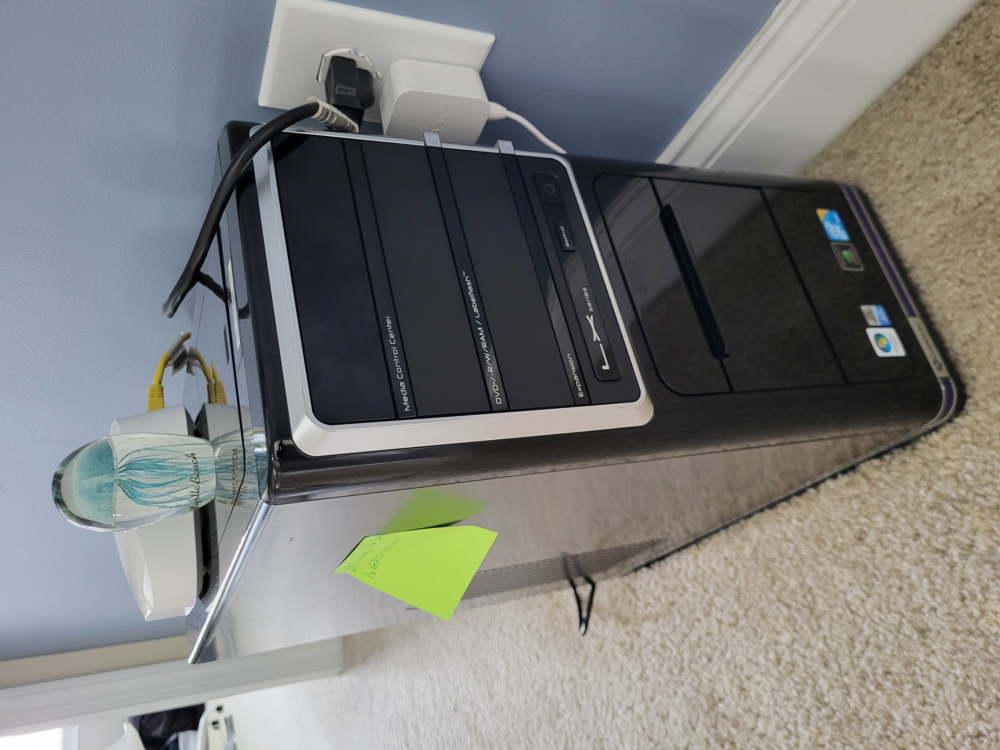
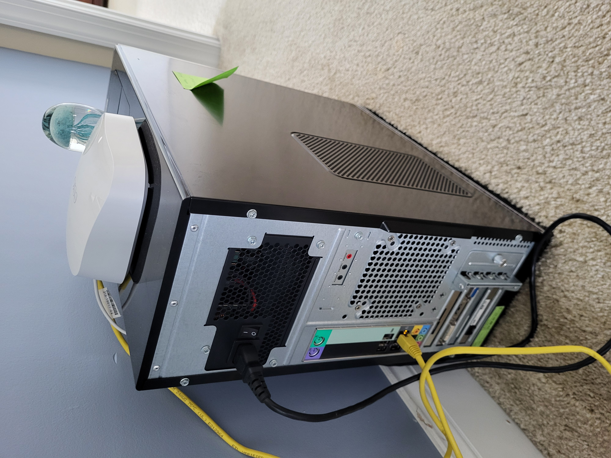

# My Homelab!

Starting in the Summer of 2024, I have had a personal server made from an old Gateway LX6810 desktop that was previously sitting in my parents' garage. It now serves as a media, backup, and experimentation server that I mess around with every so and then.

## Specifications
- Operating System: Debian 12 Stable
- RAM: 8GB
- CPU: Intel Core 2 Quad Q9650
- Storage: 7TB of HDD space, combined with JBOD

## Software
- UFW
- Nextcloud
- PiHole
- A Samba share folder

## Gallery

*TODO: add a photo of my PiHole admin panel*

## Potential Improvements
- Use a VPN like Wireguard for remote access
- Set up Nginx or Apache for HTTPS support
- Potentially host a Minecraft Server
