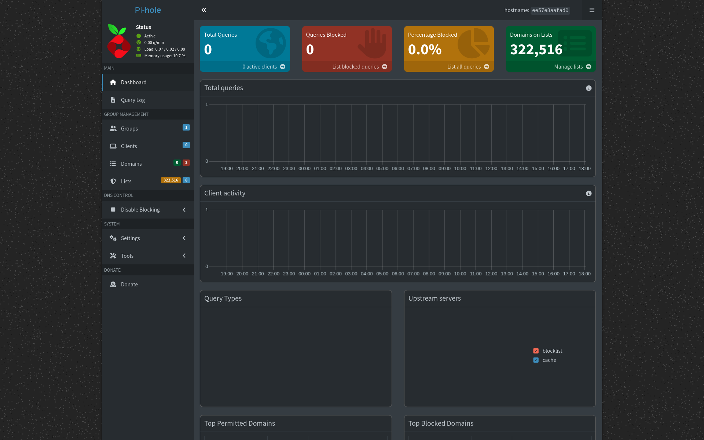
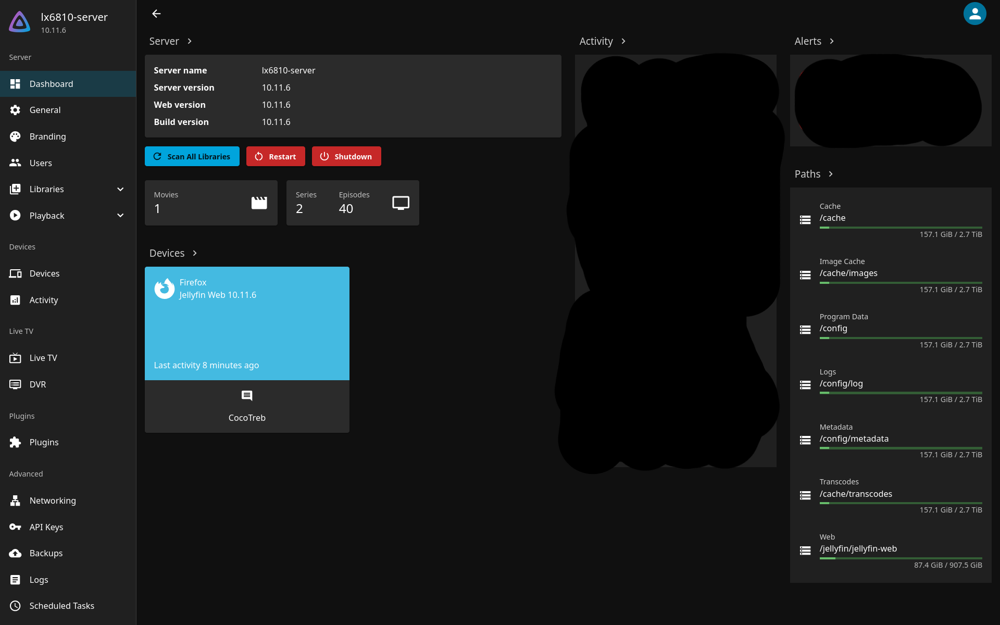

# My Homelab!

Starting in the Summer of 2024, I have had a personal server made from an old Gateway LX6810 desktop that was previously sitting in my parents' garage. It now serves as a media, backup, and experimentation server that I mess around with every so and then.

## Specifications
- Operating System: Debian 12 Stable
- RAM: 8GB DDR2
- CPU: Intel Core 2 Quad Q9650
- Storage: 7TB of HDD space, combined with JBOD

## Software
- UFW
- Nextcloud
- PiHole
- A Samba share folder
- Jellyfin
- Tailscale for remote access

## Drive Structure
Below is the output of `lsblk`. My root, boot, and swap partitions are on a 1TB SSD. One 3TB drive is for my jellyfin server, the other is for docker volumes (mainly used by Nextcloud).
My 2TB SSD is currently unused, it will probably be a backup solution.
```
NAME   MAJ:MIN RM   SIZE RO TYPE MOUNTPOINTS
sda      8:0    0   2.7T  0 disk
└─sda1   8:1    0   2.7T  0 part /srv/jellyfin
sdb      8:16   0   2.7T  0 disk
└─sdb1   8:17   0   2.7T  0 part /var/lib/docker/volumes
sdc      8:32   0 931.5G  0 disk
├─sdc1   8:33   0   923G  0 part /
├─sdc2   8:34   0   500M  0 part /boot
└─sdc3   8:35   0     8G  0 part [SWAP]
sdd      8:48   0   1.8T  0 disk
└─sdd1   8:49   0   1.8T  0 part
```

## Gallery





## Potential Improvements
- ~Use a VPN like Wireguard for remote access~
- Set up Nginx or Apache for HTTPS support
- Potentially host a Minecraft Server
